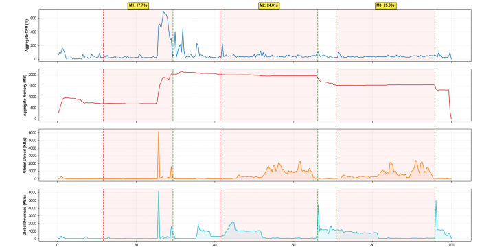

# macOS Process Tree Monitor

面向 **macOS** 的端上性能采样工具：按进程名关键词锁定 **主进程及其子进程树**，周期性聚合 **CPU、内存、句柄（FD）、线程数**，并采样本机 **上下行网速**；支持 **Enter** 标记测试区间，结束后导出 **CSV** 与 **多子图 PNG 报告**。

> 适用场景：IM / 办公客户端等多进程应用的对比测试、回归前后资源占用对比、异常路径下的资源波动观察等。

## 功能概要

- **进程树聚合**：匹配进程名关键词找到主 PID，再汇总所有祖先链包含该主进程的子进程资源。
- **可配置采样间隔**：默认 `INTERVAL = 0.3` 秒（见 `process_tree_monitor.py` 顶部）。
- **Enter 区间标记**：奇数次 Enter 为区间开始，偶数次为结束；报告中用红/绿虚线标出区间，并在 CPU 图上标注耗时。
- **产出物**：`{关键词}_Data_HHMMSS.csv`、`{关键词}_Performance_Audit_HHMMSS.png`。

## 示例报告（截图）

以下为实际采样生成的报告示例：多子图展示 **聚合 CPU、内存、整机上下行网速** 等；图中 **红/绿虚线** 为按 **Enter** 标记的区间起止，顶部的 **M1 / M2 / M3** 为各段耗时（秒）。完整报告还包含 **句柄（FD）、线程数** 等子图，运行脚本结束监控后即可在本地生成同风格 PNG。



## 环境要求

- **macOS**（基于 `psutil` 等接口采集本机进程与网络指标）。
- Python 3.9+（建议 3.10+）。
- 图形界面环境：报告生成使用 `matplotlib`，默认会 `plt.show()`。

## 安装与运行

```bash
git clone https://github.com/liushuollse-ux/macos-process-tree-monitor.git
cd macos-process-tree-monitor
python3 -m venv .venv
source .venv/bin/activate
pip install -r requirements.txt
python process_tree_monitor.py
```

按提示输入进程名关键词（例如应用可执行文件名中的连续片段，如 `Lark`、`VV` 等），待进程出现后监控开始；**Ctrl+C** 结束采样。

### 权限说明

`pynput` 监听键盘在部分 macOS 版本上需在 **系统设置 → 隐私与安全性 → 输入监控**（或「辅助功能」）中授权终端 / Python。

## 指标说明

| 列名 | 含义 |
|------|------|
| CPU(%) | 相关进程 CPU 占用之和（采样瞬时值叠加） |
| Memory(MB) | RSS 内存之和 |
| FDs(Handles) | 打开文件描述符数量之和（macOS） |
| Threads | 线程数之和 |
| Upload/Download | 自上次采样间隔内，**整机**网卡收发速率（KB/s），非单进程 |

## 免责声明

本工具仅用于本地研发与测试辅助，输出数据受采样间隔、系统负载、权限等因素影响，**不构成正式性能测评结论**；请在合规前提下使用。

## License

如无特殊说明，代码按仓库所有者指定方式使用；若需开源协议可自行补充 `LICENSE` 文件。

## 发布到 GitHub

```bash
git init
git add .
git commit -m "Add macOS process tree monitor"
git branch -M main
git remote add origin https://github.com/liushuollse-ux/macos-process-tree-monitor.git
git push -u origin main
```

已安装并登录 [GitHub CLI](https://cli.github.com/) 时，可在本目录执行：`gh repo create macos-process-tree-monitor --public --source=. --remote=origin --push`。
